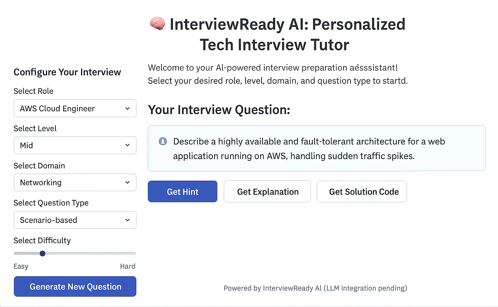

# InterviewReady AI

**An Edge-Optimized LLM for Personalized Tech Interview Prep**

## 1. Project Overview

### Core Goal
To create an AI-powered tutor that generates personalized technical interview questions, provides hints, explains concepts, and potentially evaluates user responses (future work) for specific tech roles and domains.

### Key Innovation/Challenge
The central engineering challenge is to make this LLM runnable efficiently on local machines (edge deployment) through fine-tuning and quantization. This aims to make high-quality AI tutoring more accessible and private.

### Initial Target Roles
- AWS Cloud Engineer
- AI/ML Engineer

## 2. Key Features

- **Personalized Question Generation**: Tailored to roles, experience levels, technical domains, and question types.
- **Progressive Hints**: Incremental guidance mimicking a human tutor.
- **Detailed Explanations**: Comprehensive conceptual and solution explanations.
- **Edge-Optimized Deployment**: Quantized model in GGUF format for CPU/iGPU.
- **Interactive User Interface**: Built with Streamlit.

## 3. Technical Pillars & Architecture

### Overall Project Flow

### 3.1. Domain-Specific Fine-tuning (PEFT/QLoRA)

- **Concept**: Adapt a large LLM to technical interview tasks using low-resource fine-tuning.
- **Method**: QLoRA (low-rank adapters + 4-bit quantized frozen base).
- **Base Model**: `meta-llama/Llama-2-7b-chat-hf`
- **Execution Environment**: Requires high-end GPUs (T4/A100/V100) with 16GB+ VRAM. Run on Colab Pro+ or HPC clusters.
- **Libraries**: `transformers`, `peft`, `bitsandbytes`, `trl`, `accelerate`

### 3.2. Edge Optimization (Quantization)

- **Concept**: Optimize model for CPU inference.
- **Steps**:
  - Merge LoRA adapters with base.
  - Convert to GGUF format.
  - Quantize to 4-bit or 5-bit.
- **Tools**: `llama.cpp`, `llama-cpp-python`
- **Execution**: Performed locally.

### 3.3. Interactive UI

- **Framework**: Streamlit
- **Purpose**: Parameter selection and answer visualization

## 4. Repository Structure

```
InterviewReadyAI/
├── .gitignore
├── README.md
├── LICENSE
├── requirements.txt
├── data/
│   ├── raw/
│   │   └── interview_data.jsonl
│   └── processed/
│       ├── train_dataset/
│       └── eval_dataset/
├── models/
│   └── fine_tuned_quantized_model.gguf
├── scripts/
│   ├── prepare_data.py
│   ├── train_llm.py
│   ├── optimize_model.py
│   └── inference_server.py
├── ui/
│   └── app.py
└── notebooks/  (optional)
```

## 5. Setup & Installation

### 5.1. Prerequisites
- Python 3.8+
- Git
- VS Code (optional)

### 5.2. Clone Repository

```bash
git clone https://github.com/yourusername/InterviewReadyAI.git
cd InterviewReadyAI
```

### 5.3. Virtual Environment

#### Windows

```bash
python -m venv venv
venv\Scripts\activate
```

#### macOS/Linux

```bash
python3 -m venv venv
source venv/bin/activate
```

### 5.4. Install Dependencies

```
# requirements.txt
torch==2.1.0+cpu
transformers==4.38.2
peft @ git+https://github.com/huggingface/peft.git
bitsandbytes
trl
accelerate
datasets
streamlit
llama-cpp-python
pandas
```

```bash
pip install -r requirements.txt
```

## 6. Data Strategy & Preparation

### 6.1. Raw Data Format

File: `data/raw/interview_data.jsonl`

Example entry:

```json
{
  "id": "q001",
  "role": "AWS Cloud Engineer",
  "level": "Junior",
  "domain": "Networking",
  "topic": "VPC Peering",
  "question": "What is VPC Peering and how does it differ from Transit Gateway?",
  "question_type": "Conceptual",
  "hints": ["Think about connectivity between VPCs.", "Consider scalability aspects."],
  "explanation": "VPC Peering enables direct communication...",
  "solution_code": null,
  "difficulty": "Medium"
}
```

### 6.2. Instruction-Response Format

```txt
### Instruction:
Role: AWS Cloud Engineer
Level: Junior
Domain: Networking
Topic: VPC Peering
Question Type: Conceptual

### Question:
What is VPC Peering and how does it differ from Transit Gateway?

### Explanation:
VPC Peering enables direct communication between two VPCs...
```

### 6.3. Data Preparation Script

```bash
python scripts/prepare_data.py
```

- Uses `pandas.read_json(..., lines=True)`
- Outputs Hugging Face datasets to `data/processed/`

## 7. Usage Guide

### 7.1. Step 1: Prepare Data

```bash
python scripts/prepare_data.py
```

### 7.2. Step 2: Fine-tune the LLM

> ⚠️ Requires a GPU-enabled remote environment.

```python
# train_llm.py
from transformers import AutoTokenizer, TrainingArguments, Trainer
from peft import LoraConfig, get_peft_model
from trl import SFTTrainer
from datasets import load_from_disk

model = ...  # Load base model
tokenizer = AutoTokenizer.from_pretrained(...)
train_dataset = load_from_disk("data/processed/train_dataset")
eval_dataset = load_from_disk("data/processed/eval_dataset")

peft_config = LoraConfig(...)
model = get_peft_model(model, peft_config)

trainer = SFTTrainer(
    model=model,
    args=TrainingArguments(output_dir="output", ...),
    train_dataset=train_dataset,
    eval_dataset=eval_dataset,
    tokenizer=tokenizer
)

trainer.train()
model.save_pretrained("models/final_lora_adapters")
```

### 7.3. Step 3: Optimize for Edge

```bash
python scripts/optimize_model.py
```

### 7.4. Step 4: Launch Inference Server

```bash
python scripts/inference_server.py
```

### 7.5. Step 5: Launch UI

```bash
streamlit run ui/app.py
```

## 8. Demo



## 9. Challenges & Learnings

- **Resource Constraints**: Local CPUs are inadequate for fine-tuning.
- **Hugging Face Conflicts**: `fsspec` dependency issues avoided using `pandas.read_json`.
- **Python Syntax**: f-strings with backslashes required using `NEWLINE = "\n"` workaround.
- **Prompt Engineering**: Structured `### Instruction:` blocks essential for model generalization.

## 10. Future Enhancements

- User Response Evaluation
- Adaptive Difficulty
- More Roles and Domains
- Multi-turn Conversations
- Retrieval-Augmented Generation (RAG)
- Dockerization

